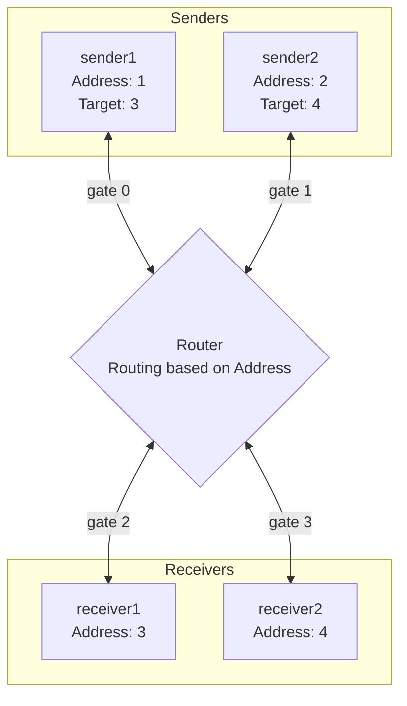

# Basic Routing Simulation

This project is an OMNeT++ network simulation that implements a basic routing mechanism alongside a **Stop-and-Wait Automatic Repeat reQuest (ARQ)** protocol over a lossy channel. The simulation models reliable data transfer between multiple senders and receivers communicating through a central router.

## What this Project Does

The simulation sets up a network topology consisting of:
- **2 Senders (`sender1`, `sender2`)**: Generate and send data packets using the Stop-and-Wait protocol. They expect an ACK for each sent packet before sending the next one. If an ACK is not received within a timeout period or a corrupted packet/ACK is received, the sender retransmits the data packet.
- **2 Receivers (`receiver1`, `receiver2`)**: Receive data packets and reply with Acknowledgment (ACK) packets. They discard corrupted packets and handle duplicate packets by resending ACKs for the last correctly received packet.
- **1 Router (`router`)**: A central node that connects all senders and receivers. It forwards packets based on their destination address using a static routing logic.

The communication happens over a `DatarateChannel` that introduces simulated propagation delay and a specific Packet Error Rate (PER), causing packets to be corrupted randomly to test the Stop-and-Wait error recovery.

## Architectural Diagram

The network topology is wired as follows:

*Note: Each connection is a bidirectional `DatarateChannel` that subjects packets to delay and potential errors.*

## Tech Stack and Tools Used

- **OMNeT++**: The discrete event simulation framework used to build and run the network model.
- **C++**: Used to implement the behavior and logic of the network nodes (Sender, Receiver, Router).
- **NED (Network Description Language)**: Used by OMNeT++ to declare modules, define their parameters/gates, and assemble the network topology (`network.ned`, `Router.ned`, `sender.ned`, `receiver.ned`).
- **OMNeT++ Message Compiler**: Used to generate C++ classes from message definitions (`packet.msg`).

## Inputs and Configuration

The primary inputs are the simulation configuration parameters defined in `omnetpp.ini`. They allow you to tweak the network conditions and node behaviors without recompiling the C++ code.

Key configurable inputs include:
- `sim-time-limit`: The maximum simulation duration (e.g., `1000s`).
- `*.channelDelay`: Propagation delay on the channels (e.g., `0.05s`).
- `*.channelDatarate`: The bandwidth of the channels (e.g., `1Mbps`).
- `*.channelError`: The Packet Error Rate (PER) simulating a lossy channel (e.g., `0.1` for a 10% chance of packet corruption).
- `*.senderTimeout`: The timeout duration for the Stop-and-Wait protocol before a sender retransmits. Must be greater than the Round Trip Time (e.g., `0.5s`).
- `*.totalPackets`: The total number of packets each sender will attempt to transmit successfully (e.g., `10`).

## Outputs

When the simulation runs, it outputs event logs and statistics, which can be viewed in the OMNeT++ IDE (Qtenv) or analyzed from command-line results.

Key outputs include:
- **Console/Event Logs (EV << ...)**: Detailed, step-by-step traces of packet generations, transmissions, router forwarding decisions, packet arrivals, ACKs, corruptions, timeouts, and retransmissions.
- **Completion States**: At the end of the simulation, nodes print their final states (e.g., `Sender 1 simulation finished. Total packets sent: 10`, `Receiver 3 simulation finished. Total new packets received: 10`).
- **Result Files**: Standard OMNeT++ output vectors/scalars (if configured) showing throughput, delays, and packet loss rates.
